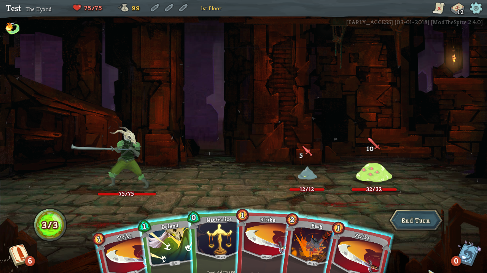

# Hybrid Character for Slay the Spire

Mod that adds a Ironclad/Silent hybrid character to the game.

The hybrid can use cards from both classes,

## Requirements ##
* ModTheSpire (https://github.com/t-larson/ModTheSpire/releases)
* BaseMod (https://github.com/daviscook477/BaseMod/releases)
* Java 8+

## Installation ##
1. [Download `ModTheSpire.jar`](https://github.com/kiooeht/ModTheSpire/releases)
2. Move `ModTheSpire.jar` into your **Slay The Spire** directory. This directory is likely to be found under `C:\Program Files (x86)\Steam\steamapps\common\SlayTheSpire`.
3. Create a `mods` folder in your **Slay The Spire** directory
4. [Download `BaseMod.jar`](https://github.com/daviscook477/BaseMod/releases), and place it in the `mods` folder.
5. [Download `HybridCharacter.jar`](https://github.com/twanvl/sts-hybrid-character/releases), and place it in the `mods` folder.
6. Your modded version of **Slay The Spire** can now be launched by double-clicking on `ModTheSpire.jar`
7. This will open a mod select menu where you need to make sure that both `BaseMod` and `HybridCharacter` are checked before clicking **play**

